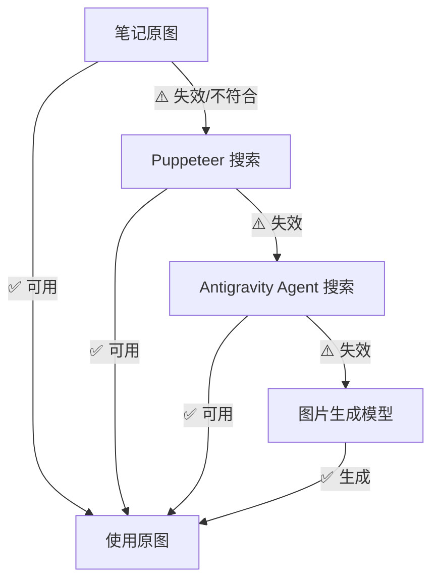

# Step 2.5: 图片多级获取与分析

**目标**：确保每个章节都有可用的配图，采用多级回退策略

---

## 回退流程图



---

## Level 1: 笔记原图检查 [FIRST PRIORITY]

**执行逻辑**：
```python
FOR each section in outline:
    note_images = get_images_from_notes(section.related_notes)
    
    FOR each image_url in note_images:
        IF NOT is_url_accessible(image_url):
            continue
        
        relevance = check_image_relevance(image_url, section)
        
        IF relevance.score >= 0.6:
            section.matched_image = image_url
            section.image_source = "note_original"
            BREAK
    
    IF section.matched_image is None:
        section.needs_fallback = True
```

### 相关性检查（VLM 智能分析）

使用 Antigravity 内置的视觉模型（`view_file` 工具）进行图片理解：

```python
def check_image_relevance(image_url, section):
    # 1. 下载图片到本地临时目录
    local_path = download_image_to_temp(image_url)
    
    # 2. 调用 view_file 查看图片（触发 VLM 分析）
    image_content = view_file(AbsolutePath=local_path)
    
    # 3. 构建相关性分析 Prompt
    analysis_prompt = f"""
    请分析这张图片与以下章节的相关性：
    
    **章节标题**：{section.title}
    **章节关键词**：{section.keywords}
    
    请从以下维度评估（每项 0-10 分）：
    1. **主题相关性**：图片内容是否与章节主题相关
    2. **视觉质量**：清晰度、构图、美观度
    3. **信息价值**：图片是否能增强章节内容的理解
    4. **专业性**：是否为专业/真实场景图片
    
    输出 JSON：
    {{
      "topic_relevance": {{"score": N, "reason": "..."}},
      "visual_quality": {{"score": N, "reason": "..."}},
      "info_value": {{"score": N, "reason": "..."}},
      "professionalism": {{"score": N, "reason": "..."}},
      "overall_score": N,
      "recommendation": "USE" | "SKIP"
    }}
    """
    
    return llm_analyze(image_content, analysis_prompt)
```

**评分标准**：
| 维度 | 权重 | 评分依据 |
|------|------|----------|
| 主题相关性 | 50% | 图片内容与章节标题/关键词的语义匹配度 |
| 视觉质量 | 20% | 清晰度 ≥ 720p，构图合理，无模糊/变形 |
| 信息价值 | 20% | 能否帮助读者理解章节内容 |
| 专业性 | 10% | 非广告、无水印/二维码、真实场景 |

**匹配阈值**：`overall_score >= 6.0` → 使用该图片

---

## Level 2: Puppeteer 图片搜索 [SECOND FALLBACK]

**触发条件**：笔记原图检查失败

```python
IF section.needs_fallback AND NOT section.matched_image:
    search_query = generate_image_search_query(section.title, section.keywords)
    
    # 1. 导航到 DuckDuckGo 图片搜索
    mcp_puppeteer_puppeteer_navigate(
        url=f"https://duckduckgo.com/?q={search_query}&iax=images&ia=images"
    )
    wait(2)
    
    # 2. 获取图片元素
    image_elements = mcp_puppeteer_puppeteer_evaluate(
        script="Array.from(document.querySelectorAll('img.tile--img__img')).slice(0, 5).map(i => i.src)"
    )
    
    # 3. 选择最佳图片
    FOR each image_url in image_elements:
        IF is_url_accessible(image_url):
            section.matched_image = image_url
            section.image_source = "puppeteer_search"
            BREAK
    
    IF section.matched_image is None:
        section.needs_agent_search = True
```

> [!TIP]
> Puppeteer 搜索优先使用 DuckDuckGo 图片搜索，选择器稳定。

---

## Level 3: Antigravity Agent 搜索 [THIRD FALLBACK]

**触发条件**：Puppeteer 搜索失败

```python
IF section.needs_agent_search AND NOT section.matched_image:
    search_query = f"{section.title} 高清图片"
    
    search_results = search_web(
        query=search_query,
        domain="images"
    )
    
    FOR each result in search_results:
        IF result.type == "image" AND is_url_accessible(result.url):
            section.matched_image = result.url
            section.image_source = "agent_search"
            BREAK
    
    IF section.matched_image is None:
        section.needs_generation = True
```

---

## Level 4: AI 图片生成 [FINAL FALLBACK]

**触发条件**：所有搜索方式均失败

```python
IF section.needs_generation AND NOT section.matched_image:
    image_prompt = generate_image_prompt(
        section_title=section.title,
        section_content=section.key_points,
        style="professional, clean, modern"
    )
    
    generate_image(
        Prompt=image_prompt,
        ImageName=f"generated_{section.index}_{section.title_slug}"
    )
    
    section.matched_image = generated_image_path
    section.image_source = "ai_generated"
```

---

## 输出格式

```markdown
## 🖼️ 图片获取结果

**统计**：
- 总章节数：[N] 个
- 使用笔记原图：[A] 个
- Puppeteer 搜索获取：[B] 个
- Agent 搜索获取：[C] 个
- AI 生成：[D] 个

**各章节图片来源**：
| 章节 | 图片来源 | 状态 |
|------|----------|------|
| [章节1] | 笔记原图 | ✅ |
| [章节2] | Puppeteer | ✅ |
| [章节3] | AI 生成 | 🎨 |
```
