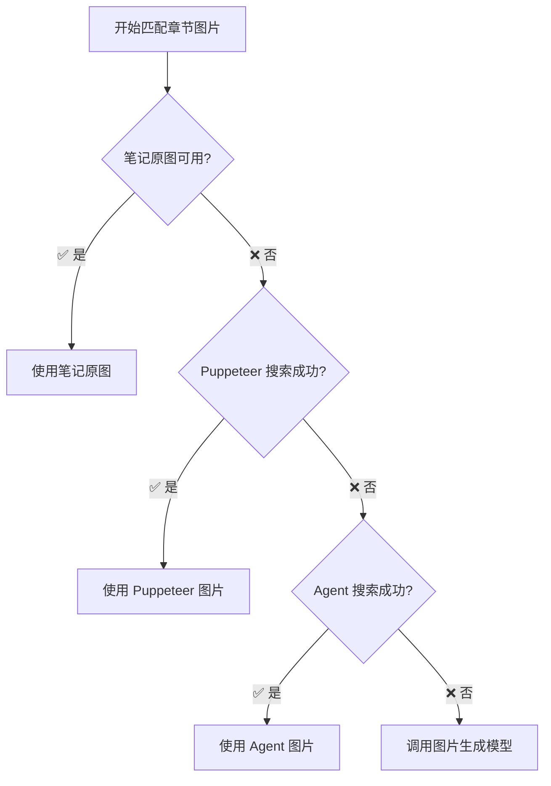

# Step 4-5: 大纲与报告生成

---

## Step 4: 大纲生成

**目标**：基于分析结果生成结构化报告大纲，并进行智能图片匹配

### 4.1 章节规划
- 根据研究维度确定主要章节（4-6 个）
- 每章节确定 2-3 个要点

### 4.2 图片匹配与回退

> [!IMPORTANT]
> 图片获取采用四级回退策略，确保每个章节都有配图。

**多级回退流程图**：


**执行逻辑**：
```python
FOR each section in outline:
    # Level 1: 检查笔记原图
    image = try_get_note_image(section)
    IF image:
        section.image = image
        section.image_source = "笔记原图"
        continue
    
    # Level 2: Puppeteer DuckDuckGo 图片搜索
    image = try_puppeteer_image_search(section.title)
    IF image:
        section.image = image
        section.image_source = "Puppeteer搜索"
        continue
    
    # Level 3: Antigravity Agent 网络搜索
    image = try_agent_web_search(f"{section.title} 高清图片")
    IF image:
        section.image = image
        section.image_source = "Agent搜索"
        continue
    
    # Level 4: AI 图片生成（最后回退）
    section.needs_generation = True
    section.image_prompt = generate_prompt(section)
```

### 4.3 大纲输出格式

```markdown
## 📋 报告大纲

1. **引言**
   - 研究背景
   - 核心问题

2. **[维度1标题]**
   - 要点 A
   - 要点 B
   - 📷 图片来源：笔记原图 | [URL]

3. **[维度2标题]**
   - 要点 A
   - 要点 B
   - 🔍 图片来源：Puppeteer 搜索 | [URL]

4. **结论与建议**
   - 关键结论
   - 行动建议
```

---

## Step 5: 报告生成

**目标**：生成图文交错的研究报告

### 5.1 逐章节生成
- 按大纲结构逐章撰写
- 每章节 100-200 字，整体 1000 字以内
- 引用原始笔记作为数据支撑

### 5.2 图片处理

```python
FOR each section in outline:
    IF section.image:
        IF section.image_source == "note_original":
            embed_image(section.image, caption="来源：小红书笔记")
        ELSE IF section.image_source == "puppeteer_search":
            embed_image(section.image, caption="来源：网络搜索")
        ELSE IF section.image_source == "agent_search":
            embed_image(section.image, caption="来源：Agent 搜索")
    ELSE IF section.needs_generation:
        generate_image(
            Prompt=section.image_prompt,
            ImageName=f"section_{section.index}_generated"
        )
```

> [!NOTE]
> 每章节生成图片时，在图片下方标注来源，增强可信度。

### 5.3 报告输出格式

```markdown
# [研究主题] 深度研究报告

> 📅 生成时间：[日期时间]
> 📊 数据来源：小红书 [N] 篇笔记
> 🎯 复杂度等级：[低/中/高]

## 📋 摘要

[100字以内的核心发现总结]

---

## 1. [章节1标题]

[100-200字正文内容，包含数据引用]


*图片来源：[笔记原图/Puppeteer搜索/Agent搜索/AI生成]*

---

## 2. [章节2标题]

[100-200字正文内容]


*图片来源：[来源标注]*

---

## 💡 结论与建议

### 核心结论
1. [结论1]
2. [结论2]

### 行动建议
- [建议1]
- [建议2]

---

## 📚 参考笔记

| # | 笔记标题 | 作者 | 点赞数 | 链接 |
|---|----------|------|--------|------|
| 1 | [标题] | @作者 | N | [查看](URL) |
| 2 | [标题] | @作者 | N | [查看](URL) |

---

*本报告由 RedNote Research Agent 自动生成*
```

**格式规范**：
- 总字数控制在 1000 字以内
- 每章节 100-200 字
- 图片必须标注来源
- 数据引用需注明原始笔记
