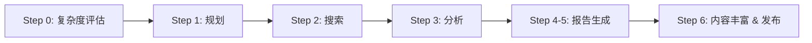

# RedNote Research Agent 工作流 (V4.0)

> **环境依赖**：
> - `xiaohongshu-mcp` - 小红书搜索、内容获取、发布（**必需**）
> - `tavily` - 流程搜索增强
> - `Puppeteer` - 网络图片、文字搜索增强
> - Antigravity 内置：语言模型、视觉模型、图片生成

> [!IMPORTANT]
> **V4 重大更新**
> - ✨ 迁移到 `xiaohongshu-mcp`，解决 xsec_token 动态管理
> - 📸 取消本地图片下载，直接使用在线 URL（提升速度）
> - 🚀 新增发布功能，支持自动发布到小红书
> - 🎨 新增封面图生成和表情符号美化

---

## 执行流程概览



**子模块引用**：
- Step 2 搜索详情：`/rednote_research_v4_search`
- Step 3 分析详情：`/rednote_research_v4_analysis`
- Step 4-5 报告生成：`/rednote_research_v4_report`
- Step 6 发布详情：`/rednote_research_v4_publish`

---

## Step 0: 任务复杂度评估

**目标**：根据研究主题复杂度，动态调整后续步骤的资源分配

### 复杂度维度分析

| 维度 | 低 (1-3) | 中 (4-6) | 高 (7-10) |
|------|----------|----------|-----------|
| 关键词数量 | 3-4 个 | 5-6 个 | 7-8 个 |
| 每关键词笔记数 | 5 篇 | 10 篇 | 15 篇 |
| 分析迭代次数 | 1 次 | 2 次 | 3 次 |
| 图片分析深度 | 仅分类 | 分类+描述 | 分类+描述+语义匹配 |

### 复杂度智能评估（LLM 驱动）

使用以下 Prompt 让 LLM 从 5 个维度评估复杂度：

1. **约束条件数量**（权重 25%）：0个=1-2分，1个=3-4分，2个=5-6分，3+=7-10分
2. **信息获取难度**（权重 25%）：常见话题=1-3分，垂直领域=4-6分，专业/小众=7-10分
3. **时效性要求**（权重 15%）：无时间要求=1-2分，近期信息=5-6分，实时性强=8-10分
4. **决策影响程度**（权重 20%）：休闲娱乐=1-3分，消费决策=4-6分，重大决策=7-10分
5. **对比分析需求**（权重 15%）：无需对比=1-2分，简单对比=4-6分，多维度对比=7-10分

**复杂度映射**：
- 加权得分 1.0-3.5 → 低 (LOW)
- 加权得分 3.6-6.5 → 中 (MEDIUM)
- 加权得分 6.6-10.0 → 高 (HIGH)

**输出格式**：
```markdown
## ⚙️ 任务复杂度评估

**复杂度等级**：[低/中/高]
**资源分配**：
- 关键词数量：[N] 个
- 每关键词笔记数：[M] 篇
- 分析迭代上限：[K] 次
```

---

## Step 1: 规划阶段

**目标**：将用户的模糊研究主题拆解为具体的搜索计划

**前置依赖**：继承 Step 0 复杂度评估结果

### 执行策略

1. **继承复杂度配置**：从 Step 0 获取 `keyword_count`、`notes_per_keyword`、`max_iterations`

2. **意图解析**：
   - 分析用户输入的研究主题
   - 识别核心关键词和约束条件（地点、预算、人群等）
   - 确定研究维度数量（低=2-3个，中=3-4个，高=4-5个）
   - 显式提取约束条件列表

3. **关键词生成规则**：
   - 每个关键词 2-6 字，用空格分隔多个词
   - 组合方式：核心词+约束、核心词+维度、核心词+场景
   - 覆盖正面（推荐、分享）和负面（避雷、避坑）角度
   - **生成数量 = Step 0 分配的 keyword_count**

**输出格式**：
```markdown
## 📋 研究规划

**继承复杂度配置**：
- 复杂度等级：[低/中/高]
- 关键词数量：[N] 个
- 每关键词笔记数：[M] 篇

**约束条件提取**：
- 地点约束：[如有]
- 预算约束：[如有]

**研究维度**：
1. [维度1]
2. [维度2]

**搜索关键词**：
- [关键词1] → 覆盖约束：[约束名]
- [关键词2] → 覆盖维度：[维度名]
```

---

## Step 2-6: 子流程调用

### Step 2: 搜索阶段
> 📎 执行子流程 `/rednote_research_v4_search`

### Step 3: 分析阶段
> 📎 执行子流程 `/rednote_research_v4_analysis`

### Step 4-5: 报告生成
> 📎 执行子流程 `/rednote_research_v4_report`

### Step 6: 内容丰富 & 发布
> 📎 执行子流程 `/rednote_research_v4_publish`

---

## 启动指令

**Agent 启动检查清单**：

1. **MCP 连接测试**：调用 `mcp_xiaohongshu-mcp_check_login_status` 检查登录状态
2. **语言控制**：所有输出使用**简体中文**
3. **执行模式**：默认执行完整流程（Step 0-6），自动根据复杂度调整资源
4. **输出目录**：创建统一输出目录结构（见下方）

### 📁 统一输出目录结构

> [!IMPORTANT]
> **所有生成文件必须保存到统一的输出目录**，便于后续流程和调试。

**目录结构**：
```
{工作空间}/output/{主题}_{日期}/
├── data/                    # 中间数据文件（仅保存 JSON，不下载图片）
│   ├── search_results.json  # 搜索结果
│   ├── notes_detail.json    # 笔记详情（含在线图片 URL）
│   └── analysis.json        # 分析结果
├── plan/                    # 规划文件
│   └── research_plan.md
├── report/                  # 最终报告
│   └── final_report.md
└── publish/                 # 发布相关
    ├── xiaohongshu_draft.json  # 发布草稿
    ├── cover_image.png         # 生成的封面图
    └── publish_log.json        # 发布历史记录
```

**创建目录命令**（在 Step 0 之后执行）：
```bash
mkdir -p output/{主题}_{日期}/{data,plan,report,publish}
```

**变量约定**：
- `OUTPUT_DIR` = `{工作空间}/output/{主题}_{日期}`
- `DATA_DIR` = `{OUTPUT_DIR}/data`
- `REPORT_DIR` = `{OUTPUT_DIR}/report`
- `PUBLISH_DIR` = `{OUTPUT_DIR}/publish`

---

## 故障恢复机制

### MCP 调用异常

| 异常场景 | 恢复策略 |
|---------|---------|
| MCP 未登录 | 提示用户在浏览器中登录小红书 |
| 搜索无结果 | 建议用户调整关键词 |
| 笔记详情获取失败 | 指数退避重试（最多3次），回退预览数据 |
| xsec_token 过期 | 重新搜索获取新 token |
| 发布失败 | 返回详细错误信息，保存草稿供手动发布 |

### 数据完整性保障

| 优先级 | 策略 | 说明 |
|--------|------|------|
| Level 1 | 使用笔记在线图片 URL | 直接保存 URL，发布时使用 |
| Level 2 | 使用预览图 URL | 详情获取失败时的降级方案 |
| Level 3 | AI 图片生成 | 封面图生成（Step 6A） |

---

*V4.0 更新时间：2025-12-28*
